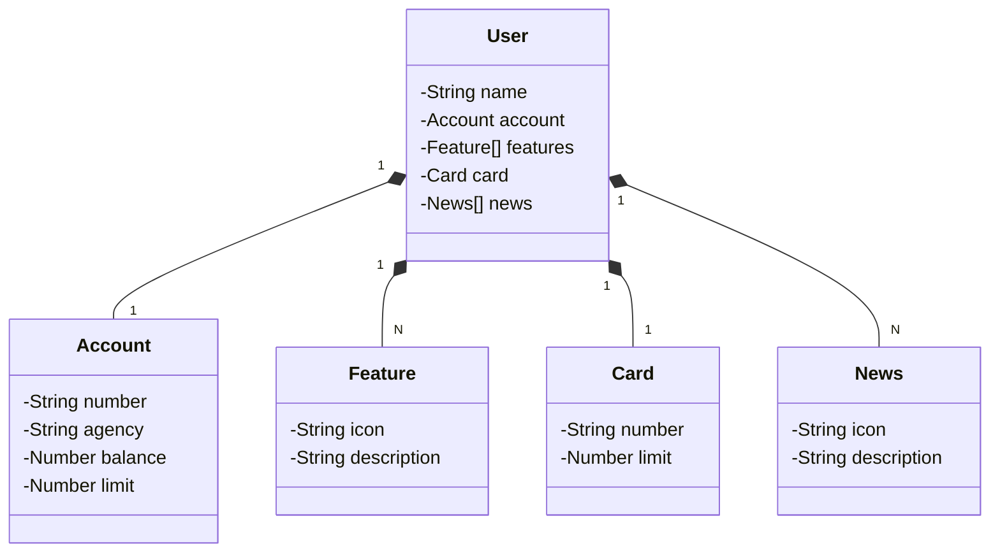

## Ferramentas e tecnologias utilizadas

- java 17;
- Spring Boot 3;
- Swagger;
- Postgres
- Railway
- intellij

## Descrição básica
- Esta api visa criar um Back-end de uma aplicação bancaria.

## Diagrama de classes

## Extras

### acessar o console do h2 database 
- http://localhost:8080/h2-console

### acessar a url no swagger
- http://localhost:8080/swagger-ui/index.html

### json online edit
- https://jsoneditoronline.org/

